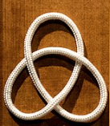
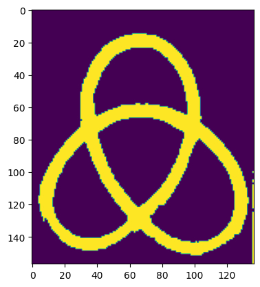
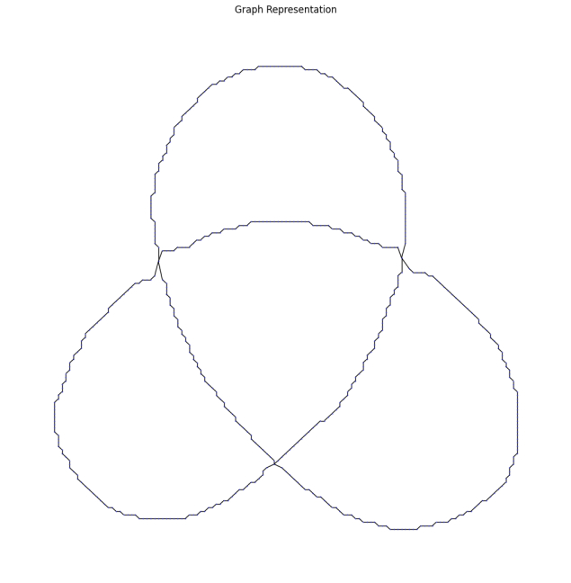
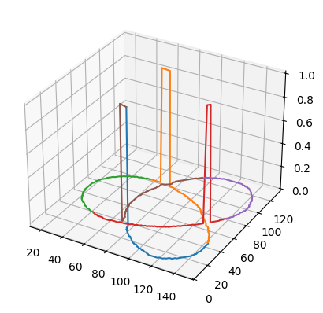
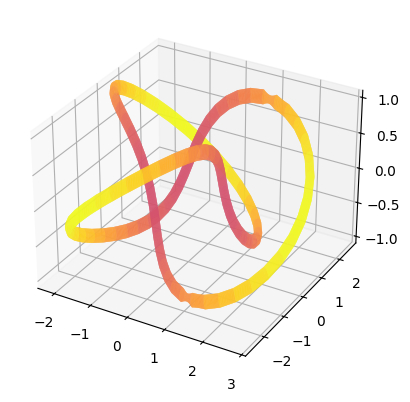

# Knot Id

This is an effort to identify the reduced knot from a picture of a closed loop of string. It involves segmentation, skeletonization, crossing identification, crossing characterization, conversion to a 3D graph of the knot, and the knot reduction.

## Usage
Install [requirements](./requirements.txt). Open [gui.py](./gui.py), change the input and output images' directories and run file. In the GUI, choose the top branch color (key bindings are outlined in the script). Note that the success of the run depends heavily on the parameters used and the properties of the input images. Tweek these values in the notebooks to see what works best for your data and than use them in the main [gui.py](./gui.py). You can also try to change segmentation algorithm to fit your data (a few are proposed in [segmentation.ipynb](./segmentation.ipynb)). 

## Outline
The process starts with a picture of some closed loop of rope.

    

Then, the knot is first segmented either using Otsu, watershed, region-based, or color-based segmentation. The choice of segementation should depend on the input pictures of the knots. Some methods perform better on pictures with more contrast others with wider rope. Choose the method that works best with your dataset.

    

After this, the segmentation is skeletonized. Again, the choice of algorithms depends on the data. Here, [T. Y. Zhang and C. Y. Suen's thinning algorithm](https://teaching.vda.univie.ac.at/ipa/18w/Lab3/Zhan-Suen_algorithm.pdf) is used. The skeleton is converted to a graph. The graph is cleaned by removing unconnected segments, redundant edges, and by filling small gaps. Also, the crossing points are joined and identified.

    

Using the gui interface, the user can analyze the crossings identified. The user characterizes which strands passes over the other. At the end of the process, the graph is transposed to 3 dimensions. Note that the automatic characterization of crossings was attempted using a fine-tuned base convolutional neural network. However, this effort was inconclusive

    

Finally, using the PyKnotid knot identification tool along with its knot database, the knot is characterized (as trefoil for example). We can then plot a 3D visualization of the knot in question.

    

Note that there are some issues with the PyKnotid library. It is recommended to clone the PyKnotId repository and fix errors along the way.
